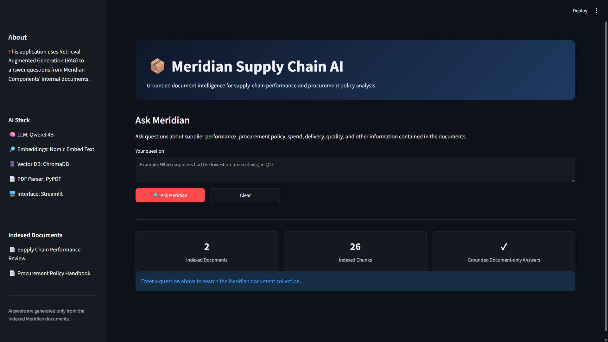
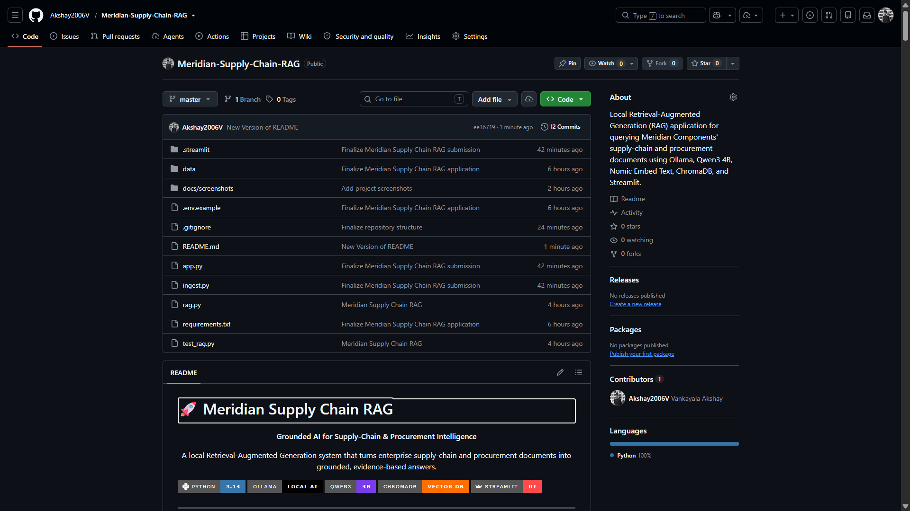

# 🚀 Meridian Supply Chain RAG

<p align="center">
  <strong>Grounded AI for Supply-Chain & Procurement Intelligence</strong>
</p>

<p align="center">
  A local Retrieval-Augmented Generation system that turns enterprise supply-chain and procurement documents into grounded, evidence-based answers.
</p>

<p align="center">


</p>

---

## 📌 Overview

**Meridian Supply Chain RAG** is a local, document-grounded AI assistant designed for supply-chain and procurement intelligence.

Instead of manually searching through long PDF documents, users can ask natural-language questions and receive concise answers grounded in the indexed Meridian Components knowledge base.

The system is designed around one core principle:

> **Retrieve the evidence first. Answer only from the evidence. Do not fabricate unsupported information.**

The complete workflow runs locally using Ollama, ChromaDB, and the supplied Python components. No OpenAI API key is required.

---

# 🎯 Problem Statement

Supply-chain and procurement teams regularly work with documents containing:

- Supplier performance metrics
- Procurement policies
- Purchase-order approval rules
- Delivery performance
- Quality and defect information
- Inventory and safety-stock requirements
- Supplier classification criteria
- Production interruptions
- Operational and sourcing risks

Important information may be distributed across multiple documents. Conventional document search can make it difficult to connect those facts and answer operational questions quickly.

For example:

> **A supplier has poor delivery performance and a high defect rate. What procurement-policy consequences apply?**

Answering that question may require information from both:

1. A supplier performance review
2. A procurement policy handbook

This project demonstrates how RAG can connect those sources and provide grounded answers through an interactive application.

---

# 💡 Solution

Meridian Supply Chain RAG combines document ingestion, embeddings, vector retrieval, deterministic answer paths, and local LLM synthesis.

```text
PDF Documents
      ↓
Text Extraction
      ↓
Recursive Chunking
      ↓
Nomic Embeddings
      ↓
ChromaDB
      ↓
Semantic Retrieval
      ↓
Relevant Evidence
      ↓
Deterministic Answer / Qwen3 Synthesis
      ↓
Grounded Response
      ↓
Source References
```

The result is a lightweight local knowledge assistant for supply-chain and procurement analysis.

---

# 🧠 System Architecture

```text
                    ┌──────────────────────────┐
                    │       User Question      │
                    └────────────┬─────────────┘
                                 │
                                 ▼
                    ┌──────────────────────────┐
                    │     Query Embedding      │
                    │    Nomic Embed Text      │
                    └────────────┬─────────────┘
                                 │
                                 ▼
                    ┌──────────────────────────┐
                    │        ChromaDB           │
                    │   Semantic Vector Search  │
                    └────────────┬─────────────┘
                                 │
                                 ▼
                    ┌──────────────────────────┐
                    │   Retrieved PDF Chunks   │
                    │  + source/page metadata  │
                    └────────────┬─────────────┘
                                 │
                         ┌───────┴────────┐
                         │                │
                         ▼                ▼
                ┌────────────────┐  ┌────────────────┐
                │ Deterministic  │  │    Qwen3 4B   │
                │ Answer Path    │  │  Synthesis     │
                └───────┬────────┘  └───────┬────────┘
                        │                   │
                        └─────────┬─────────┘
                                  │
                                  ▼
                    ┌──────────────────────────┐
                    │      Grounded Answer     │
                    │   + Source References    │
                    └──────────────────────────┘
```

---

# 🔄 RAG Workflow

## 1. Document Ingestion

PDF files are processed using **PyPDF**.

The ingestion process preserves document and page information so that retrieved evidence can be traced back to its source.

## 2. Text Chunking

Extracted text is split using LangChain's recursive text splitter.

```text
Chunk size : 1000 characters
Overlap    : 150 characters
```

The overlap helps preserve context across adjacent chunks.

## 3. Embedding Generation

Each text chunk is converted into a vector representation using:

```text
nomic-embed-text
```

## 4. Vector Storage

Embeddings and document metadata are stored in a persistent:

```text
ChromaDB
```

collection.

## 5. Query Retrieval

A user question is embedded and compared against the indexed knowledge base.

```text
Question
   ↓
Query Embedding
   ↓
ChromaDB Search
   ↓
Relevant Chunks
```

## 6. Answer Generation

The system uses deterministic answer paths for supported factual queries and can use **Qwen3 4B** when additional synthesis is required.

## 7. Grounded Responses

The retrieved document evidence forms the basis of the answer.

Relevant source and page information can be shown alongside the response.

## 8. Unsupported Information Handling

When the requested information is not contained in the available knowledge base, the system refuses to invent an answer.

Example:

```text
User:
What is the annual salary of the Head of Procurement?

Meridian:
I cannot answer that from the supplied documents.
```

This is an intentional hallucination-control mechanism.

---

# ⭐ Key Features

## 📄 Document Knowledge Base

The supplied knowledge base contains:

```text
Meridian_Procurement_Policy_Handbook_v4.2.pdf
Meridian_Supply_Chain_Review_Q1_FY2025-26.pdf
```

## 🔎 Semantic Search

Natural-language questions are converted into embeddings and matched against relevant document chunks using ChromaDB.

## 🏭 Supply-Chain Intelligence

The assistant supports questions involving:

- Supplier performance
- Supplier spend
- Delivery performance
- Quality metrics
- Defect rates
- Procurement policy
- Purchase-order approval authority
- Safety stock
- Supplier classification
- Line stoppages
- Supply-chain risks

## 🧾 Policy-Aware Reasoning

Supplier-performance evidence can be interpreted together with procurement-policy rules.

```text
Supplier Evidence
       +
Procurement Policy
       ↓
Applicable Procurement Decision
```

## 🚫 Hallucination Resistance

When information is not supported by the documents, the system prefers an explicit refusal over fabrication.

## 💬 Native Streamlit Interface

The application uses native Streamlit components and provides:

- Knowledge-base summary
- Native sidebar
- Chat history
- New-chat control
- Suggested questions
- Native chat composer
- PDF attachments directly from the chat composer
- Multiple PDF attachments
- Automatic document ingestion
- Source references
- Native Streamlit menu/settings

## ⚡ Local Execution

The core AI workflow runs locally with Ollama and ChromaDB.

No external OpenAI API key is required.

---

# 🧪 Automated Validation

The repository includes:

```text
test_rag.py
```

The test suite covers six representative scenarios:

| # | Validation Scenario |
|---|---|
| 1 | Highest-spend supplier |
| 2 | Line stoppages and downtime |
| 3 | Purchase-order approval authority |
| 4 | Critical supplier classification |
| 5 | Safety-stock calculation |
| 6 | Unsupported question handling |

### Final Validation Result

```text
Passed: 6
Failed: 0
Total : 6

RESULT: ALL TESTS PASSED
```

These tests provide repeatable validation of the core RAG behavior.

---

# 💬 Example Questions

## 1. Highest-Spend Supplier

> Which supplier had the highest spend in Q1, and what was its on-time delivery percentage?

**Expected result:** Shenzhen Rui Electronics had the highest Q1 spend at **₹21.9 crore**, with **79.5% on-time delivery**.

## 2. Line Stoppages

> How many line stoppages happened in Q1, what was the total downtime, and what caused them?

**Expected result:** **7 line-stoppage events** and **41 hours of downtime**, involving microcontroller shortages, rejected PCB lots, and a transporter strike.

## 3. Purchase-Order Approval

> What is the approval authority for a purchase order worth ₹1.4 crore?

**Expected result:** Approval from the **Chief Operating Officer**.

## 4. Supplier Classification

> What are the four supplier classification categories, and what qualifies a supplier as Critical?

**Expected result:**

```text
Critical
Strategic
Standard
Tail
```

Critical classification can include conditions such as:

- Single-source supply
- Annual spend above ₹10 crore
- Safety-related components

## 5. Procurement Policy Consequence

> Kaveri Metals had 88.1% on-time delivery and 1,150 PPM defects in Q1. What procurement policy consequences apply?

**Expected result:** The defect rate exceeds the applicable 500 PPM threshold, triggering the relevant quality clause, rework-cost responsibility, and increased incoming inspection requirements.

## 6. Single-Source Supplier

> The microcontroller supplier is single-source. What does the sourcing policy require?

**Expected result:** A qualified second source must be established within the policy's specified period, with temporary mitigation while alternate-source qualification is underway.

## 7. Safety Stock

> Microcontrollers are imported with a 46-day lead time. Using the safety-stock policy, how many days of stock should be held?

**Expected result:**

```text
46 × 0.25 = 11.5 days
```

The applicable policy floor makes the required safety stock:

**30 days**

## 8. Unsupported Information

> What is the annual salary of the Head of Procurement?

**Expected result:**

```text
I cannot answer that from the supplied documents.
```

This demonstrates the system's grounded-answer behavior.

---

# 🖥️ Application Interface

The final interface is implemented with native Streamlit components.

The main application provides:

### Knowledge Base

Displays the indexed document and chunk counts.

### Chat

Users can ask natural-language questions directly through the native chat composer.

### PDF Attachments

Users can attach one or more PDF documents directly through the chat composer.

Attached documents are written to the local `data/` directory and passed through the existing ingestion pipeline.

### Chat History

Conversation titles are maintained for the current application session.

### New Chat

Starts a fresh conversation without changing the indexed knowledge base.

### Sources

Retrieved source documents and page references can be shown with grounded answers.

---

# 📸 Screenshots

## Streamlit Application



*Final Meridian Supply Chain AI interface showing the knowledge base, native Streamlit workflow, chat experience, and document-grounded assistant.*

## GitHub Repository



*Final streamlined GitHub repository containing the application, documents, tests, screenshots, and project documentation.*

---

# 🛠️ Technology Stack

| Component | Technology |
|---|---|
| Programming Language | Python 3.14 |
| LLM Runtime | Ollama 0.6.2 |
| Language Model | Qwen3 4B |
| Embedding Model | Nomic Embed Text |
| Vector Database | ChromaDB 1.5.9 |
| PDF Parser | PyPDF 6.16.1 |
| Text Splitting | LangChain Text Splitters 1.1.2 |
| User Interface | Streamlit 1.61.1 |
| Version Control | Git + GitHub |

The pinned dependencies are defined in `requirements.txt`.

---

# 📁 Final Project Structure

```text
Meridian-Supply-Chain-RAG/
│
├── .streamlit/
│   └── config.toml
│
├── data/
│   ├── Meridian_Procurement_Policy_Handbook_v4.2.pdf
│   └── Meridian_Supply_Chain_Review_Q1_FY2025-26.pdf
│
├── docs/
│   └── screenshots/
│       ├── meridian_app_home.png
│       └── meridian_github.png
│
├── .env.example
├── .gitignore
├── README.md
├── app.py
├── ingest.py
├── rag.py
├── requirements.txt
└── test_rag.py
```

Generated files such as:

```text
.venv/
__pycache__/
chroma_db/
```

are intentionally excluded from version control.

---

# ⚙️ Installation & Setup

## Prerequisites

Install:

- Python
- Git
- Ollama

Verify:

```powershell
python --version
git --version
ollama --version
```

## 1. Clone the Repository

```powershell
git clone https://github.com/Akshay2006V/Meridian-Supply-Chain-RAG.git
cd Meridian-Supply-Chain-RAG
```

## 2. Create the Virtual Environment

```powershell
python -m venv .venv
```

Activate on Windows PowerShell:

```powershell
.\.venv\Scripts\Activate.ps1
```

## 3. Install Dependencies

```powershell
pip install -r requirements.txt
```

## 4. Install Ollama Models

```powershell
ollama pull qwen3:4b
ollama pull nomic-embed-text
```

Verify:

```powershell
ollama list
```

## 5. Build the Local Document Index

The ChromaDB vector store is generated locally and is not committed to GitHub.

Run:

```powershell
python ingest.py
```

The ingestion flow is:

```text
PDF
 ↓
PyPDF extraction
 ↓
Recursive chunking
 ↓
Nomic embeddings
 ↓
ChromaDB
```

## 6. Run the CLI RAG

```powershell
python rag.py
```

Example:

```text
Enter your question:

What is the approval authority for a purchase order worth ₹1.4 crore?
```

## 7. Run the Streamlit Application

```powershell
streamlit run app.py
```

Open:

```text
http://localhost:8501
```

The interface supports:

- Natural-language questions
- Chat history
- New conversations
- PDF attachments
- Automatic indexing
- Document-grounded responses

---

# 🧪 Run the Test Suite

```powershell
python test_rag.py
```

Expected:

```text
Passed: 6
Failed: 0
Total : 6

RESULT: ALL TESTS PASSED
```

---

# 🔐 Local & Privacy-Oriented Design

The project is designed around local execution:

- LLM inference runs through Ollama
- Embeddings are generated locally
- ChromaDB is stored locally
- Source documents remain in the local project environment
- No OpenAI API key is required

This architecture is suitable for document collections where keeping the core retrieval workflow local is important.

---

# 🚫 Limitations

Meridian Supply Chain RAG is a document-grounded assistant, not a general-purpose enterprise database or unrestricted AI system.

Answer quality depends on:

- The coverage of the indexed documents
- Retrieval quality
- The embedding model
- The supplied policy and performance data
- The quality of the source PDFs

The application deliberately does not provide information that is absent from its knowledge base.

---

# 📌 Assignment

This project was developed as part of the:

**HCLTech × Economic Times AI Masterclass**

The implementation demonstrates:

- Local RAG architecture
- Semantic document retrieval
- Grounded answer generation
- Unsupported-question handling
- Automated validation
- Interactive Streamlit deployment

---

# ✅ Final Status

```text
Project      : Meridian Supply Chain RAG
Interface    : Streamlit
LLM          : Qwen3 4B via Ollama
Embeddings   : Nomic Embed Text
Vector DB    : ChromaDB
Validation   : 6 / 6 tests passed
Execution    : Local
Repository   : GitHub
Status       : Finalized
```

---

# 🔗 Repository

**GitHub:**  
https://github.com/Akshay2006V/Meridian-Supply-Chain-RAG
